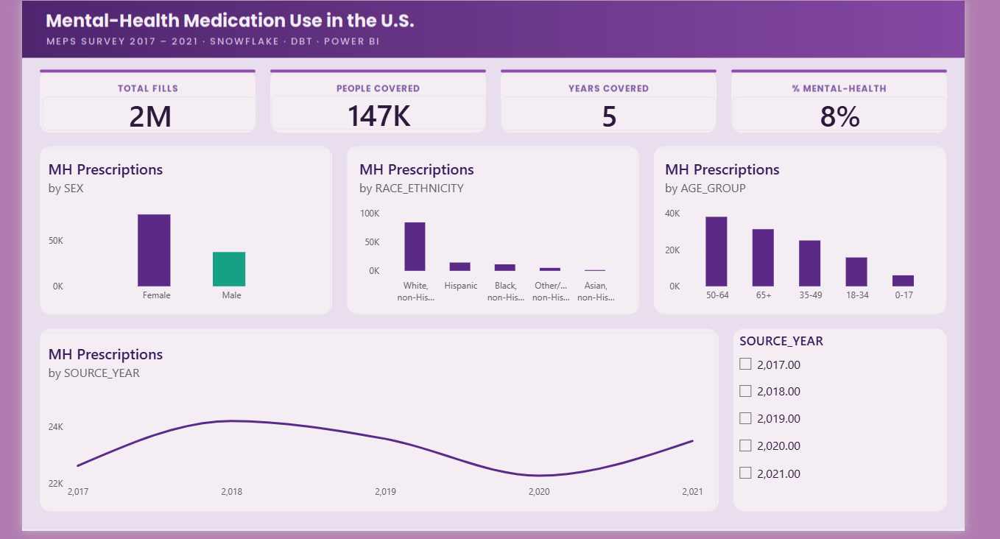
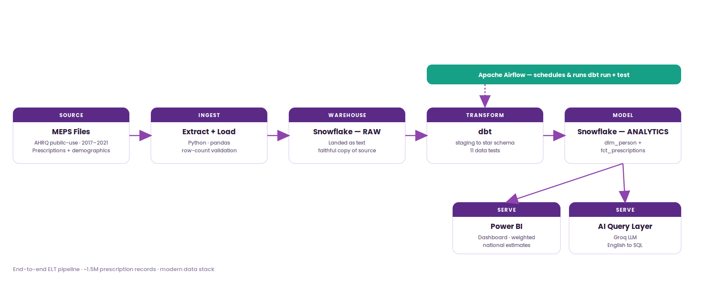

# Mental-Health Medication Pipeline 🧠💊

An end-to-end **ELT data pipeline** on real U.S. government health survey data, built on the modern data stack and topped with orchestration and an AI query layer.

> **The finding:** across 2017–2021, women in the U.S. filled roughly **twice** the mental-health prescriptions that men did — a weighted national estimate of about **836 million** fills for women versus **412 million** for men. Getting that number *right* — not just counted, but correctly weighted across five years of shifting survey files — was the real work.



---

## Architecture



Raw government files → Python extract/load → Snowflake → dbt star schema (tested) → Power BI + an AI query layer, with Apache Airflow orchestrating the transform on a schedule.

---

## Tech stack

| Layer | Tools |
|-------|-------|
| Extract + Load | Python (`pandas`, `requests`), `snowflake-connector-python` (stage → `COPY INTO`) |
| Warehouse | Snowflake |
| Transform / tests | dbt (`dbt-core`, `dbt-snowflake`) |
| Orchestration | Apache Airflow (Astro CLI, Docker) |
| BI / visualization | Power BI (DAX, survey-weighted measures) |
| AI layer | Groq LLM — natural-language → SQL |
| Version control | Git / GitHub |

---

## The data

[MEPS](https://meps.ahrq.gov/) — the Medical Expenditure Panel Survey, a nationally representative survey run by the U.S. Agency for Healthcare Research and Quality (AHRQ). Public, de-identified, no individual patient records.

- **Prescribed Medicines** files (HC-197A … HC-229A) — one row per prescription fill
- **Full Year Consolidated** files (HC-201 … HC-233) — one row per person, with demographics
- Five years, **2017–2021**, stacked → **~1.5 million prescription fills** and **~147,000 person-years**
- Mental-health medications identified by Multum primary therapeutic class `TC1 = 242` (psychotherapeutic agents)

---

## How it works

1. **Extract** — Python downloads each year's two MEPS files, parses the Stata format, and **validates the row count against AHRQ's published figure** (fails loudly on a mismatch). The year-stamped columns (`PERWT21F`, `POVCAT21`, …) are normalized to a stable schema so every year stacks identically.
2. **Load** — files are staged to Snowflake and bulk-loaded with `COPY INTO` into a `RAW` schema, landed as text (a faithful copy of the source), with the loaded row count verified against the local file.
3. **Transform (dbt)** — staging models type and decode the raw columns; mart models build a **star schema** — `dim_person` (person-year grain) and `fct_prescriptions` — in an `ANALYTICS` schema.
4. **Test (dbt)** — 11 data tests: not-null, uniqueness, accepted values, and a referential-integrity check that every prescription links to a real person-year.
5. **Orchestrate (Airflow)** — a DAG runs `dbt run` → `dbt test` on a schedule, with the dependency enforced (tests only run if the build succeeds).
6. **Serve** — a Power BI dashboard with **survey-weighted national estimates**, and an AI layer that turns plain-English questions into live Snowflake SQL.

---

## The two hard problems (and how I handled them)

**Schema drift across years.** MEPS renames its year-stamped columns every year and changed its file format in 2017. A naive loop breaks immediately. The extractor templates the year into each column name and normalizes to a stable schema, so five years stack cleanly into one model — adding a year is a one-line config change.

**Counts lie; weights don't.** MEPS surveys ~28,000 people per year to represent ~330 million Americans, and each person carries a survey weight. Counting sample rows answers "how many in the sample?"; summing weights answers "how many *nationally*?" — the only figure a health analyst would actually report. The dashboard uses weighted national estimates, not raw counts.

---

## Data caveats (read before quoting the numbers)

- Counts are **prescription-fill events, not distinct people** — one person with twelve refills counts twelve times.
- Weighted figures are **weighted totals**. Formal confidence intervals require the survey design variables (`VARSTR` / `VARPSU`) via balanced repeated replication — not computed here, so no precision beyond the point estimate is claimed.
- The data measures **prescriptions, not diagnoses**. It can describe the disparity (women fill ~2× the mental-health prescriptions men do), consistent with higher documented rates of diagnosed depression and anxiety in women — but it cannot explain the *cause*, which lives in diagnosis and help-seeking behavior the dataset doesn't contain.

---

## Repository structure

```
.
├── extract/              # download + parse + validate MEPS files -> raw CSV
├── load/                 # stage + COPY INTO Snowflake RAW, with verification
├── meps_analytics/       # dbt project: staging views + star schema + tests
├── ai/                   # natural-language -> SQL query layer (Groq)
├── airflow/              # Astro/Airflow project: DAG orchestrating dbt
└── docs/                 # dashboard + architecture images
```

---

## Run it yourself

```bash
# 1. Environment
python -m venv venv && source venv/bin/activate   # Windows: .\venv\Scripts\Activate.ps1
pip install -r requirements.txt

# 2. Add Snowflake credentials to .env  (see .env.example)

# 3. Extract + load all five years
for y in 2017 2018 2019 2020 2021; do
  python extract/extract_meps.py $y
  python extract/extract_demographics.py $y
  python load/load_to_snowflake.py pmed $y
  python load/load_to_snowflake.py demographics $y
done

# 4. Transform + test (dbt, in its own env)
cd meps_analytics && dbt run && dbt test

# 5. Ask a question in English (AI layer)
python ai/ask.py "Weighted mental-health fills per year"
```

---

## Status

Complete, end to end: extract + load (5 years) · dbt star schema + 11 tests · Power BI dashboard · AI query layer · Airflow orchestration.

*Built as a data-engineering portfolio project. All data is public and de-identified; this analysis is descriptive, not medical or clinical guidance.*
